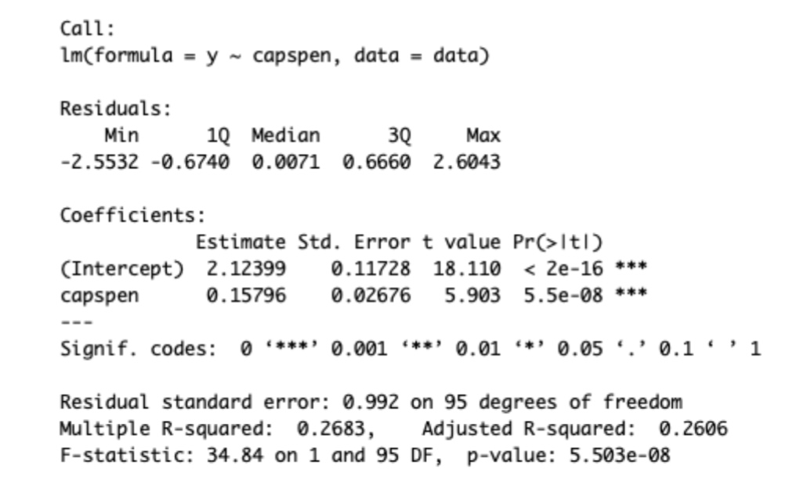
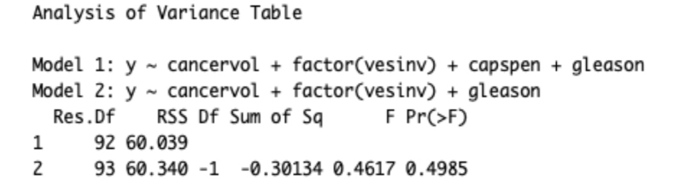
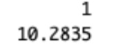

# Mini Project 6 Report
**Jiadao Zou
jxz172230**
## Question
Consider the prostate cancer dataset available on eLearning as prostate cancer.csv. It consists of data on 97 men with advanced prostate cancer. A description of the variables is given in Figure 1. We would like to understand how PSA level is related to the other predictors in the dataset. Note that vesinv is a qualitative variable. You can treat gleason as a quantitative variable.
Build a “reasonably good” linear model for these data by taking PSA level as the response variable. Carefully justify all the choices you make in building the model. Be sure to verify the model assumptions. In case a transformation of response is necessary, try the natural log transformation. Use the final model to predict the PSA level for a patient whose quantitative predictors are at the sample means of the variables and qualitative predictors are at the most frequent category.


# Answer
## Analyse
- > First we draw the boxplot of the PSA
```
# Read data
data <- read.csv("prostate_cancer.csv")
# boxplot drawing
boxplot(data$psa, main="Distribution Graph of PSA levels")
```

**As we could see, the original distribution is not good cause there are many outliers and two tails are not balanced.**

- > Then, we plot the Natural Log distribution of PSA and have a look
```
boxplot(log(data$psa), main="Distribution Graph of Log of PSA levels")
```

**This time, natural log transformation makes the distribution less skewed and reduce the number of outliers.   
Therefore, we should use transformed Distribution of PSA levels.**
```
y <- log(data$psa)
```

- > Next, we try to fit the response to each predictors left. Also, notice that "vesinv" is a qualitative variable and "gleason" is a quantitative value.
<!--1-->
- >
> -  Transformed PSA level && "cancervol"
> 
```
plot(data$cancervol, y, main="Transformed PSA level && cancervol)
fit1 <- lm(y ~ cancervol, data = data)
summary(fit1)
```    


   <!--2-->
> - Transformed PSA level && "Weight"
> 
```
plot(data$weight, y, main="Transformed PSA level && weight)
fit2 <- lm(y ~ weight, data = data)
summary(fit2)
```   


> - Transformed PSA level && "Age"
> 
```
plot(data$age, y, main="Transformed PSA level && Age)
fit3 <- lm(y ~ age, data = data)
summary(fit3)
```   


> - Transformed PSA level && "Benpros"
> 
```
plot(data$benpros, y, main="Transformed PSA level && Benpros)
fit4 <- lm(y ~ benpros, data = data)
summary(fit4)
```   


> - Transformed PSA level && "Capspen"
> 
```
plot(data$capsen, y, main="Transformed PSA level && Capsen)
fit5 <- lm(y ~ capsen, data = data)
summary(fit5)
```   


> - Transformed PSA level && "Gleason"
> 
```
plot(data$gleason, y, main="Transformed PSA level && Gleason)
fit6 <- lm(y ~ gleason, data = data)
summary(fit6)
```


> - Transformed PSA level && "vesinv"
> 
```
plot(data$vesinv, y, main="Transformed PSA level && Vesinv)
fit7 <- lm(y ~ vesinv, data = data)
summary(fit7)
```

<!--3-->  
- > From the above summary:
> - 
>**As we have seen, features: {cancervol, capspen, gleason and vesinv} are significant predictors because their t-test p-values are $\leq$ 0.05.**
>
> - Build a linear model with above significant predictors
> 
> 
```
fit8 <- lm(y ~ cancervol + factor(vesinv) + capspen + gleason, data=data)
summary(fit8)
```

    We could see that "capspen" is not significant. To verify it, we should use ANOVA table:
    ```
    fit9 <- lm(y ~ cancervol + factor(vesinv) + gleason, data=data)
    anova(fit8, fit9)
    ```
    
    Since the P-value is $\gg 0.05$, it indicates "capspen" is insignificant. **Also, we want to make sure the features we drop at the very beginning are really unimportant.**
    ```
    fit10 <- lm(y ~ cancervol + weight + factor(vesinv) + gleason, data=data)
    anova(fit10, fit9)
    ```
    
    ```
    fit11 <- lm(y ~ cancervol + age +factor(vesinv) + gleason, data=data)
    anova(fit11, fit9)
    ```
    
```
fit12 <- lm(y ~ cancervol + benpros + factor(vesinv) + gleason, data=data)
anova(fit12, fit9)
```

**From the above images, anova shows "benpros" is important. Which means the feature we should use to construct the linear model are {cancervol, benpros, vesinv, gleason}, and we could see the final model as below:**
```
fit12
```

So, the mathematics question:
$ln(PSA)=-0.65013+0.06488*cancervol+0.09136*benpros+0.6842(vesinv=1)+0.33376*gleason$ 
- > **Analyse our model**
> - Now, plot the residual graph for the linear model we build:
> 
```
plot(fitted(fit12), resid(fit12), main="Residual Plot")
abline(h=0)
```
> 
> Resident points are scattered around zero and there is no obvious pattern of these points.
> 
> - Now, plot the Normal Q-Q plot for the linear model we build:
> 
```
qqnorm(resid(fit12))
qqline(resid(fit12))
```
> 
> From above plot,  It’s good if residuals are lined well on the straight dashed line. In other words, residual points are approximately around the straight line which means the errors are normally distributed.  
> 
> - Then, we take a look at time series plot:
> 
```
plot(resid(fit9), type="1", main="Tine Series Plot")
abline(h=0)
```
> 
> From that series plot, we could not see there is obvious pattern between time interval and residual points. That shows out model is good because errors are independent.
>
- > **Final step, comparing our model with AIC generated models**
> - Backward AIC:
> 
```
fit13.backward <- step(lm(y ~ cancervol + weight + age + benpros + factor(vesinv) + capspen + gleason, data=data), scope = list(lower = ~-1), direction = "backward")
```

> - Forward AIC:
> 
```
fit13.forward <- step(lm(y ~ 1, data=data), scope = list(upper = ~cancervol + weight + age + benpros + factor(vesinv) + capspen + gleason), direction = "forward")
```

> - Both AIC:
> 
```
fit13.forward <- step(lm(y ~ cancervol + weight + age + benpros + factor(vesinv) + capspen + gleason, data=data)), scope = list(upper = ~cancervol + weight + age + benpros + factor(vesinv) + capspen + gleason), direction = "both")
```

> - **Result of above three different stepwise model selection methods agree with our model.**
> 
- > **Predicting:**
> - concervol:
> 
```
concervol <- mean(data$concervol)
concervol
``` 

> - benpros:
> 
```
benpros <- mean(data$benpros)
benpros
```

> - vesinv:
> 
```
vesinv.t <- table(factor(data$vesinv))
vesinv <- names(which.max(vesinv.t))
vesinv
```

> - gleason
> 
```
gleason <- mean(data$gleason)
gleason
```

> - Predicting the response by current predictor and arguments
> 
```
arguments <- data.frame(cancervol: cancervol, benpros: benpros, vesinv: vesinv, gleason: gleason)
PSA_log_response <- predict(fit12, arguments)
exp(PSA_log_response)
```

So the predicted PSA level is 10.2835.


 
    


